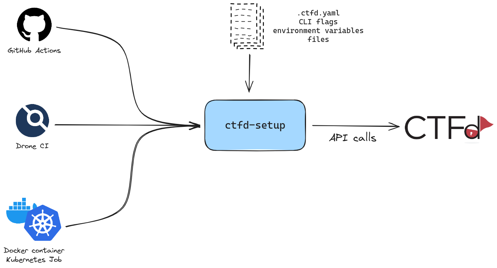

<div align="center">
  <h1>CTFd-Setup</h1>
  <p><b>Version your CTFd setup configuration.</b><p>
  <a href="https://pkg.go.dev/github.com/ctfer-io/ctfd-setup"></a>
  <a href=""></a>
  <a href="https://coveralls.io/github/ctfer-io/ctfd-setup?branch=main"></a>
	<br>
	<a href="https://github.com/ctfer-io/ctfd-setup/actions/workflows/codeql-analysis.yaml"></a>
  <a href="https://securityscorecards.dev/viewer/?uri=github.com/ctfer-io/ctfd-setup"></a>
  
</div>

CTFd does not have the concept of **configuration file**, leading to **deployment complications** and the **impossibility to version configurations**.
This is problematic for reproducibility or sharing configuration for debugging or replicating a CTF infrastructure.

Moreover, the setup API does not exist, so we had to map it to what the frontend calls in [go-ctfd](https://github.com/ctfer-io/go-ctfd/blob/main/api/setup.go).

To fit those gaps, we built `ctfd-setup` on top of the CTFd API. This utility helps setup a CTFd instance from a YAML configuration file, CLI flags and environment variables.
Thanks to this, you can integrate it using **GitHub Actions**, **Drone CI** or even as part of your **IaC provisionning**.

With `ctfd-setup` you can **setup your CTFd in a second**.

## How to use

<div align="center">
    
</div>

### YAML

You can use `ctfd-setup` as a CLI tool and provision it a YAML configuration file.

```yaml
appearance:
  name: 'My CTF'
  description: 'My CTF description'

admin:
  name: 'admin'
  email: 'admin@super.ctf'
  password: 'admin_password'

mode: users
```

**We encourage you to version this file** such that re-deployment is easy (e.g., for test purposes, or in case of a catastrophic failure of the infra during the event).
Nevertheless, please do not commit the admin credentials ! Use the corresponding environment variables and provide their value from a safe secret store.

For further configuration, please refer to the binary's specific API through `ctfd-setup --help`.

If you are using it as part of Infra as Code provisionning, you can map the values of this configuration file to environment variables (which could ease your job).

### GitHub Actions

To improve our own workflows and share knownledges and tooling, we built a GitHub Action: `ctfer-io/ctfd-setup`.
You can use it given the following example.

```yaml
name: 'My workflow'

on:
  push:
    branches:
      - 'main'

jobs:
  my-job:
    runs-on: 'ubuntu-latest'
    steps:
      - name: 'Setup CTFd'
        uses: 'ctfer-io/ctfd-setup@v1.4.4'
        with:
          url: ${{ secrets.CTFD_URL }}
          appearance_name: 'My CTF'
          appearance_description: 'My CTF description'
          admin_name: ${{ secrets.ADMIN_USERNAME }}
          admin_email: ${{ secrets.ADMIN_EMAIL }}
          admin_password: ${{ secrets.ADMIN_PASSWORD }}
          # ... and so on (non-mandatory attributes)
```

### Drone CI

This could also be used as part of a Drone CI use `ctferio/ctfd-setup`.

```yaml
kind: pipeline
type: docker
name: 'My pipeline'

trigger:
  branch:
  - main
  event:
  - push

steps:
  # ...

  - name: 'Setup CTFd'
    image: 'ctferio/ctfd-setup@v1.4.4'
    settings:
      url:
        from_secret: CTFD_URL
      appearance_name: 'My CTF'
      appearance_description: 'My CTF description'
      admin_name:
        from_secret: ADMIN_USERNAME
      admin_email:
        from_secret: ADMIN_EMAIL
      admin_password:
        from_secret: ADMIN_PASSWORD
      # ... and so on (non-mandatory attributes)
```

## Security

### Signature and Attestations

For deployment purposes (and especially in the deployment case of Kubernetes), you may want to ensure the integrity of what you run.

The release assets are SLSA 3 and can be verified using [slsa-verifier](https://github.com/slsa-framework/slsa-verifier) using the following.

```bash
slsa-verifier verify-artifact "<path/to/release_artifact>"  \
  --provenance-path "<path/to/release_intoto_attestation>"  \
  --source-uri "github.com/ctfer-io/ctfd-setup" \
  --source-tag "<tag>"
```

The Docker image is SLSA 3 and can be verified using [slsa-verifier](https://github.com/slsa-framework/slsa-verifier) using the following.

```bash
slsa-verifier slsa-verifier verify-image "ctferio/ctfd-setup:<tag>@sha256:<digest>" \
    --source-uri "github.com/ctfer-io/ctfd-setup" \
    --source-tag "<tag>"
```

Alternatives exist, like [Kyverno](https://kyverno.io/) for a Kubernetes-based deployment.

### SBOMs

A SBOM for the whole repository is generated on each release and can be found in the assets of it.
They are signed as SLSA 3 assets. Refer to [Signature and Attestations](#signature-and-attestations) to verify their integrity.

A SBOM is generated for the Docker image in its manifest, and can be inspected using the following.

```bash
docker buildx imagetools inspect "ctferio/ctfd-setup:<tag>" \
    --format "{{ json .SBOM.SPDX }}"
```
