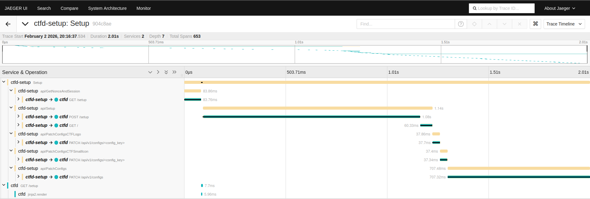

# Example - OpenTelemetry

As the tool supports OpenTelemetry, this example shows how to technically use it in a demo environment.

## Try it out!

- Run an OpenTelemetry Collector to capture signals (here we focus on traces), Jaeger for distributed traces visualization, and our [instrumented and repackaged CTFd](https://github.com/ctfer-io/ctfd-packaged) for OpenTelemetry support.
    ```bash
    docker compose up -d
    ```

- Setup the environment variables for the tool to pick up its configuration.
    ```bash
    export OTEL_EXPORTER_OTLP_ENDPOINT=dns://localhost:4317
    export OTEL_EXPORTER_OTLP_INSECURE=true
    export OTEL_EXPORTER_OTLP_PROTOCOL=grpc
    ```

- Run `ctfd-setup` :smile:
    ```bash
    go run ../../cmd/ctfd-setup/main.go --url http://localhost:8000 --file .ctfd.yaml
    ```

- Open Jaeger and visualize traces: [`http://localhost:16686`](http://localhost:16686)
<div align="center">
    
</div>

- You can delete the infra :wink:
    ```bash
    docker compose down -v
    ```
